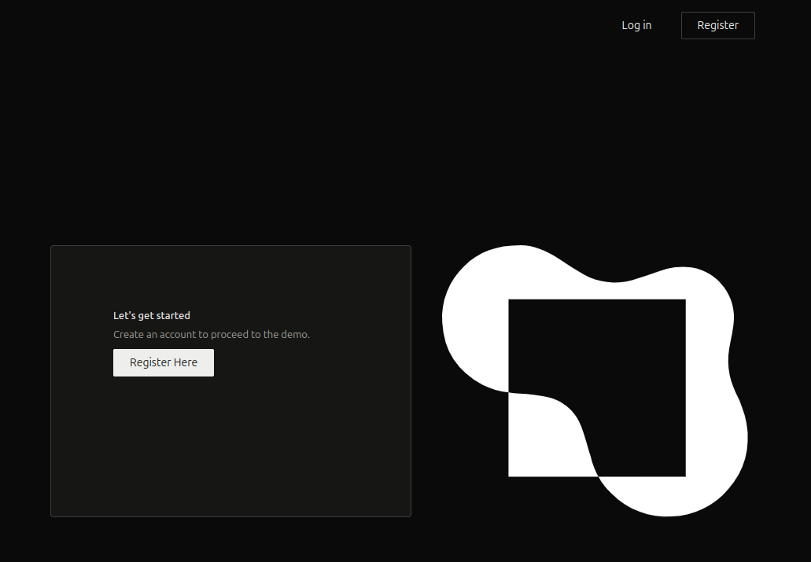
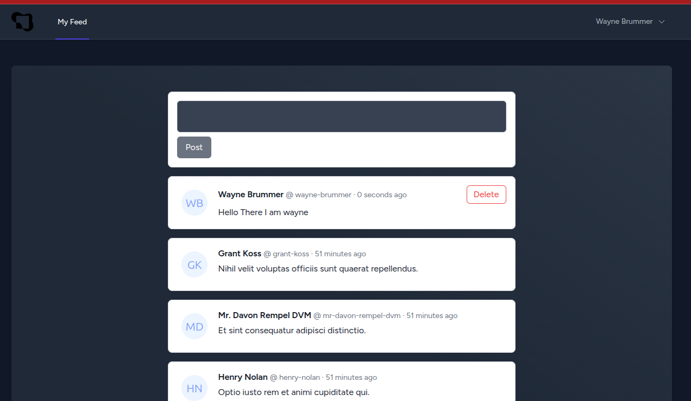
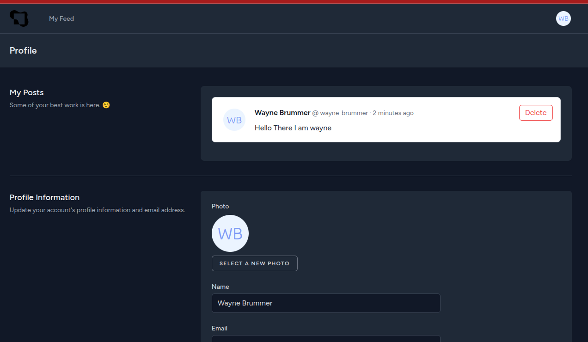

# Zellerfeld Microblogging Platform (X Clone)

Welcome to the **Zellerfeld Microblogging Platform**, a lightweight Twitter/X clone built with **Laravel**.
This guide will help you set up the project quickly on your local machine **without Docker/Sail**.

## **Installation Guide**

### **General Prerequisites**

Ensure you have the following installed before proceeding:

- [Git](https://github.com/git/git)
- [Composer](https://getcomposer.org/)

### **Local PHP Prerequisites**

- [NodeJS v16+](https://nodejs.org/en/download)
- [PHP 8.4+](https://php.net/)

#### **Installing PHP (Linux/Mac)**

If you don’t already have PHP 8.4 installed, run:

```shell
/bin/bash -c "$(curl -fsSL https://php.new/install/linux/8.4)"

```

### 1️⃣ Clone the repository

```shell
git clone https://github.com/WayneBrummer/microblog.git
cd microblog
```

### 2️⃣ Setup Steps (Local PHP)

Run the following commands in order:

```shell
# Install dependencies
composer install
npm install

# Setup environment & database
composer setup

# Start the development server
composer dev
```

### 3️⃣ Run Tests

```shell
php artisan test
```

## Screenshot

### **Landing**



### **Feed**



### **User Profile**



## Troubleshooting

### If the images do not load. Replace the APP_URL

```dotenv
APP_URL=http://localhost:8000
```

### Opening the application

You can then Open the page from the terminal or this link [http://localhost:8000/](http://localhost:8000/).
